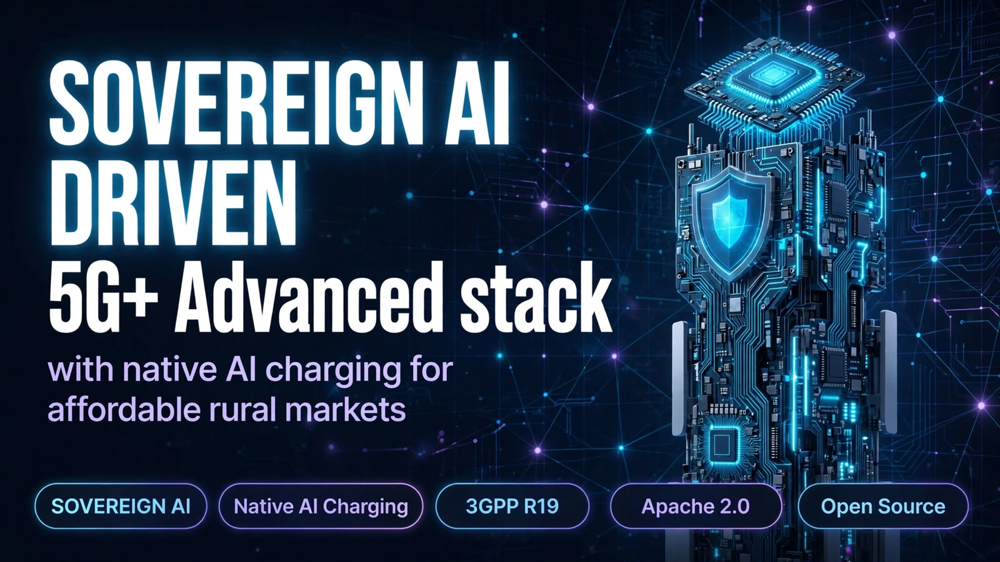
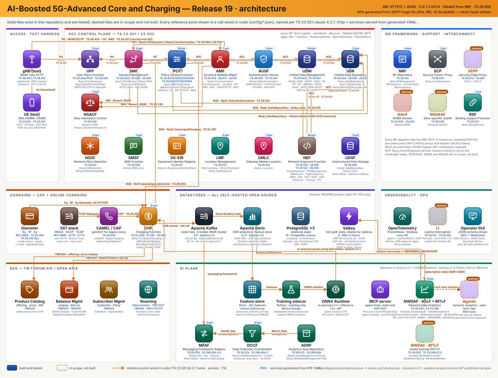

<p align="center">
  <picture>
    <source media="(prefers-color-scheme: dark)" srcset="docs/assets/title-dark.svg">
    
  </picture>
</p>

<p align="center">
  <picture>
    <source media="(prefers-color-scheme: dark)" srcset="docs/assets/motto-dark.svg">
    
  </picture>
</p>

A modular, standards-faithful 5G Core (5GC) and Charging (**CHF + Online Charging, Gy/CAP**) implementation in modern C++, targeting 3GPP
**R19 (5G-Advanced)**. R19 is what 3GPP itself brands *5G-Advanced*; 6G has no
stage-3 specification yet and nothing here implements it, so it is deliberately absent from
the title. **When Release 20 lands and 3GPP defines 6G, the intent is to carry this
architecture forward and revisit the name then** — a statement of direction, not a
capability claim. Every Network Function's northbound API is meant to be **generated**
from the official 3GPP OpenAPI YAML — never hand-written — with a TM Forum SID-aligned
charging/BSS domain, a JSON-schema-driven operator GUI, and AI/ML pipelines wired into **both
NWDAF and the CHF**. The charging half is the CHF of TS 32.290/32.291 plus the
online-charging interfaces it terminates: Diameter Gy credit-control with quota and
re-authorization, Sy spending limits, and CAMEL/CAP for the legacy voice estate. *OCS* is
deliberately not used as the title — TS 32.296 defines that as its own network function, this does
not implement it, and a title should not need a footnote to be true.

**Why this matters:**
- 70% of world still lacks affordable 5G. Vendor cores cost $500k+. This is Apache 2.0.
- Built in modern C++ with CMake+vcpkg, with full spec traceability from 3GPP R19 YAML specs.
- Real telco-grade features: NRF/AMF/SMF/UDM/UDR/AUSF/PCF, N4/PFCP, UPF with real eBPF/XDP fast path, CHF converged charging (TS 32.290) with Gy/Sy/CAP, TMF620/632/651/654 BSS, NWDAF AnLF/MTLF with ONNX Runtime.

**Sovereign AI-Boosted**:
- NWDAF AnLF: NF_LOAD, ABNORMAL_BEHAVIOUR from real charging data, SERVICE_EXPERIENCE per S-NSSAI.
- CHF: AI-driven rating & spending-limit policies, anomaly detection for fraud/overuse.
- Can be Powered locally by any LLMs(Sovereign AI) like  Meta's Muse Glimmer 30B (Apache 2.0) for LLM-as-judge, policy reasoning, and offline operation - no cloud dependency for rural deployments.
- 100% open infrastructure: Apache Doris, Kafka (KRaft), PostgreSQL 16, Valkey 8 (replaces Redis per OSI compliance), MLflow, scikit-learn.

This targets a **production-grade, spec-traceable reference implementation** (raised from an
original lab-grade scope — see `docs/DECISIONS.md` ADR-0009 for why and what that changed).

Repo slug (`5gc-r19`) and technical identifiers (CMake project name, vcpkg package name) stay as
short slugs; this is the display name. See [`docs/DECISIONS.md`](docs/DECISIONS.md) for every
architectural choice made (and rejected) along the way.

[](https://github.com/prajithparan/AI-Boosted-5G-Advanced-Core-and-Charging-R19/actions/workflows/ci.yml)
[](LICENSE)

<h2 align="center">Architecture</h2>


<p align="center">
  <a href="docs/diagrams/architecture.svg">
    <picture>
      <source media="(prefers-color-scheme: dark)" srcset="docs/diagrams/architecture-dark.svg">
      
    </picture>
  </a>
</p>

<h2 align="center">Source of truth</h2>

3GPP OpenAPI YAML (REL-19, vendored under [`specs/`](specs/)) is the only source for API shapes,
paths, schemas, and enums used anywhere in this repo. Nothing here hand-writes a DTO that the YAML
can generate, and nothing invents a TS number, reference point, or field name that isn't in the
spec text. Full conventions are in [`CLAUDE.md`](CLAUDE.md).

<h2 align="center">Status</h2>

| Phase | What | Status |
|---|---|---|
| 0 | Foundations: CMake+vcpkg skeleton, `libs/sbi-core` (HTTP/2, OAuth2, ProblemDetails, headers, logging, tracing), TLS 1.3 + mTLS | Done |
| 1 | Codegen spine: `tools/sbi-codegen`, generated DTOs/serializers from the R19 YAML | Done |
| 2 | Control-plane core: NRF, AMF, SMF, UDM, UDR, AUSF, PCF; UE registration + PDU session establishment end-to-end | Done |
| 3 | User plane: N4/PFCP, UPF datapath (including a real eBPF/XDP fast path) | Done |
| 4 | Charging + TM Forum SID/BSS layer | Live-verified end to end |
| 5 | NWDAF + AI/ML pipelines | In progress — AnLF (Nnwdaf_AnalyticsInfo + EventsSubscription + DataManagement; NF_LOAD from data collected via the DCCF, predicted with the MTLF's model in-process via ONNX Runtime; ABNORMAL_BEHAVIOUR from real charging data, SERVICE_EXPERIENCE from the SMF QOS_MON feed aggregated per S-NSSAI, ADR-0358/0360/0368/0369/0379), MTLF (Nnwdaf_MLModelProvision, Python training sidecar + MLflow, models through the ADRF, ADR-0369), MFAF (ADR-0365), DCCF (ADR-0366), ADRF (ADR-0367) on the no-in-process-state architecture of ADR-0359; Nnwdaf_MLModelMonitor accuracy loop (ADR-0370); the VFL hook -- Nnwdaf_VFLTraining/VFLInference subscription surface (ADR-0380); next roaming / HFL (ADR-0359 step 6) |
| 6 | R19 feature NFs (Tier 2/3) | In progress — 10 of 16 Tier 2 NFs built (5G-EIR, SMSF, GMLC, LMF, NSACF, NWDAF-AnLF, MFAF, DCCF, ADRF, UDSF); Tier 3 not started |
| 7 | GUI / operations console | **Started** — React + JSON Forms operator GUI behind a C++ backend-for-frontend (`gui/`, ADR-0420..0425): OIDC login against a real, self-hosted Keycloak realm (ADR-0441 — authorization-code + PKCE, real TOTP MFA gating a real `acr` claim via Keycloak step-up; back-channel logout and per-action step-up still deferred), shop-scoped RBAC + maker-checker + hash-chained audit in the `operator_iam` DB, customer onboarding, TMF620 catalog proposals, approvals, and NF configuration (schemas derived for all 31 components; four-eyes editing live for `product-catalog` only). `oam-gui-bff` is now containerized for compose (Dockerfile, `docker-compose.yml` service, ADR-0442) — the login proof runs a real, compiled `oam-gui-bff` binary in a real container against a real, containerized Keycloak, both sharing the lab CA; the Node/`gui/web` build stage ran and was verified inside Docker, but the C++ builder stage (`vcpkg`, `asn1c`, `cmake --build`) never completed inside Docker in this session — three attempts were all defeated by host network conditions before finishing, disclosed in full in ADR-0442, which also has the exact command for whoever next has a working link to build and reverify the real image. The Helm chart also lands with this ADR but is lint/template-verified only — it does not start in a real cluster yet (no chart in this repo provisions `operator_iam`'s PostgreSQL in-cluster). Dear ImGui engineering console: later track. Scope still fixed: **all** product/tariff/policy configuration must be GUI-editable (ADR-0289) |
| 8 | Lab packaging (`make lab-up`) | Partial — Docker + Compose for all 22 NF/BSS components; Helm for 7 of 18 NFs; no `make lab-up` yet |
| P4.12 | Telco-grade hardening (TPS governance, chaos, business alarming, retention, autoscaling) | Done except P11, which is deferred — see [`docs/COMPLIANCE_P1_P15.md`](docs/COMPLIANCE_P1_P15.md) |

**Phase 2** — all 7 NFs implemented; both target procedures (TS 23.502 §4.2.2.2.2 UE Registration,
§4.3.2.2.1 PDU Session Establishment) verified end-to-end over real NGAP/N2 (SCTP + ASN.1 PER) and
NAS-5GS in a single `nr-gnb`/`nr-ue` interop run: NG Setup → Initial Registration (including a real
SQN resynchronization) → SecurityModeCommand/Complete → RegistrationAccept → AM Policy Association
with PCF → PDU Session Establishment, built from PCF's real QoS decision and delivered to the UE
via `Namf_Communication`. See `docs/DECISIONS.md` ADR-0032–ADR-0038 and
[`docs/TRACEABILITY.md`](docs/TRACEABILITY.md) for exactly what was proven how. That flow was
originally a manual `nr-gnb`/`nr-ue` interop run; ADR-0264–ADR-0267 turned it into an automated
regression test, driving the same procedures from the project's own test gNB and UE over a real
SCTP association (`AmfNgapTestGnb.RegisteredUeEstablishesARealPduSession`).

**Phase 3** — UPF registers with NRF, answers PFCP Heartbeat/Association/Session Establishment;
SMF discovers UPF via `Nnrf_NFDiscovery` and creates a real N4 session on every PDU Session
Establishment. The eBPF/XDP datapath passes the BPF verifier, registers TEIDs from real PFCP
signalling in a live BPF map, and decapsulates a real GTP-U packet end-to-end to the TUN device.
See ADR-0043.

**N28/Sy** — the spending-limit chain now runs end to end, CHF → PCF → SMF: PCF pushes a real
`SmPolicyNotification` to the `notificationUri` SMF supplies, and SMF serves the `pcf-notify`
callback it had been advertising since ADR-0038 with nothing behind it. The status→policy mapping
is **operator data** (`policy_counter_actions` in `config/pcf.json`), not code, because TS 29.594
leaves `currentStatus` a free-form string the spec never enumerates — the GUI that edits that data
lands with Phase 7 (ADR-0286).

**Phase 4** — CHF live-verified for the full charging lifecycle (`Nchf_ConvergedCharging`
Create/Update/Release, real quota-consumption tracking and re-authorization closing the loop
through UPF usage measurement and a live PFCP Session Modification, ADR-0050). Real legacy
interconnect (SS7 M3UA+SCCP, TCAP, MAP, CAP/CAMEL, Diameter Gy/Rf) and a real TM Forum BSS layer
(product-catalog/TMF620, balance-management/TMF654, subscriber-management/TMF632,
roaming-interconnect/TMF651) are all live-verified over mTLS. GSMA TAP3 roaming-CDR encoding is
wired end-to-end. See [`docs/CHARGING_MAPPING.md`](docs/CHARGING_MAPPING.md) for the SID/BSS field
mapping.

**P4.12 (telco-grade hardening)** — per-protocol TPS spike protection across **all three** protocol
front doors (SBI on all 22 servers, Diameter, and SS7/M3UA — ADR-0280/0285/0288, each off unless
configured); chaos tests that kill CHF mid-session and partition the balance store, asserting no
lost usage and no double-charge (ADR-0281); business-level alarming wired to real exported metrics
with Prometheus rules (ADR-0282); CDR retention that archives before it deletes (ADR-0283).

Two things that hardening deliberately did **not** close, both recorded rather than glossed:
**P8 autoscaling is blocked by architecture** — only UDR and CHF hold no in-process state, so only
UDR has an HPA; moving the other NFs' state out of process is scheduled with **P11**
(ADR-0284). And **P11 geo-redundancy itself is deferred** by decision. The full matrix, including a
ranked list of what would still block a production deployment, is in
[`docs/COMPLIANCE_P1_P15.md`](docs/COMPLIANCE_P1_P15.md).

<h2 align="center">Open-source products</h2>

**With the license each actually ships under** (from the vcpkg port
metadata and the projects' own LICENSE files — not recalled). P1 is strict OSI-only; the two rows
that need a word are marked.

| Layer | Product | Version | License |
|---|---|---|---|
| CDR analytics / feature store | Apache Doris | 4.1.3 | Apache-2.0 |
| Event bus | Apache Kafka (KRaft) | 3.9.0 | Apache-2.0 |
| Relational | PostgreSQL | 16 | PostgreSQL License |
| Partition automation (`charging` event tables) | pg_partman | 5.5.0 | PostgreSQL License (ADR-0392) |
| Session cache | **Valkey** | 8 | BSD-3-Clause — replaces Redis 7.4 (RSALv2/SSPL, not OSI), per ADR-0044 |
| Inference | ONNX Runtime | 1.23.2 | MIT |
| Model tracking | MLflow | sidecar | Apache-2.0 |
| Model training (sidecars) | scikit-learn · skl2onnx · onnx | sidecar | BSD-3-Clause · Apache-2.0 · Apache-2.0 |
| HTTP/2 · TLS | nghttp2 · OpenSSL · curl | 1.69 · 3.6.3 · 8.21 | MIT · Apache-2.0 · curl |
| Async | Boost.Asio / Beast | 1.91 | BSL-1.0 |
| JSON | nlohmann/json · simdjson | 3.12 · 4.6.6 | MIT · Apache-2.0 OR MIT |
| Kafka client | librdkafka | 2.14.2 | BSD-2-Clause (port metadata unset; LICENSE file verified) |
| DB clients | libpqxx · redis-plus-plus · libmariadb | 8.0.2 · 1.3.15 · 3.4.8 | BSD-3-Clause · Apache-2.0 · LGPL-2.1+ |
| Telemetry · logging | opentelemetry-cpp · spdlog | 1.28 · 1.17 | Apache-2.0 · MIT |
| Auth | jwt-cpp | 0.7.2 | MIT |
| Errors | tl-expected | 1.3.1 | CC0-1.0 — a public-domain dedication OSI declined to list (2012). Permissive; **flagged for P1 review**, not hidden |
| Tests | GoogleTest · libFuzzer | 1.17 | BSD-3-Clause · Apache-2.0 WITH LLVM-exception |
| Operator GUI (`gui/web`) | React · JSON Forms (core/react/vanilla) | 19.3 · 3.8.0 | MIT · MIT |
| GUI build only | TypeScript · Vite (rolldown, lightningcss) | 5.9 · 8.3 | Apache-2.0 · MIT (MIT, MPL-2.0) — whole npm lockfile gated OSI-only by ctest (ADR-0420) |
| Operator GUI identity provider | Keycloak | 26.0 | Apache-2.0 — self-hosted OIDC, authorization-code + PKCE, TOTP MFA (ADR-0441) |

<h2 align="center">Commercial products the CHF/BSS model supports today</h2>

Product and tariff definitions are **TMF620 catalog data, not code** (principle P7): CHF's rating
engine reads `ratingGroup`, `validityTime`, `quotaHoldingTime` and the volume/time/unit quota
thresholds from a `ProductOfferingPrice`'s own `prodSpecCharValueUse` extension points, and grants
from its `unitOfMeasure`. So the shapes below are expressed by configuring offerings, not by
changing C++.

Stated at the honest level of detail — what is really expressible today, and what is not:

| Commercial product | Status | What backs it |
|---|---|---|
| **Slice- / UPF- / DNN-scoped bundle** (e.g. 10 GB on slice 1, 5 GB on slice 10, or an allowance tied to one UPF) | **Supported** | a `chargingScope` characteristic on the offering price constrains it by any attribute the N40 request carries — `sNSSAI`, `uPFID`, `dnnId`, `ratType`, `hPlmnId`, `servingCNPlmnId` and more (ADR-0303). An array means any-of, so one bundle can span several slices. Catalog data, so a new scoped product is not a code change. **All three protocols**: N40 scopes on the TS 32.291 request, Diameter Gy on every AVP the peer sent — by wire code (`Gy.avp.432`) and by real TS 32.299 name (`Gy.Rating-Group`), 613 names cross-checked four ways — and CAMEL/CAP on the InitialDP's own parameters (ADR-0346, ADR-0351). **CAP scoping is not yet exercised end-to-end** — unit-tested at the edges only, see ADR-0351 |
| **Data bundle** (e.g. 10 GB) | **Supported** | `unitOfMeasure` GB/MB → `GrantedUnit.totalVolume`, with real quota consumption tracking and re-authorization driven by UPF usage measurement over PFCP (ADR-0050) |
| **Service-unit bundle** (e.g. N events/messages) | **Supported** | any non-GB/MB `unitOfMeasure` → `GrantedUnit.serviceSpecificUnits` |
| **Prepaid / real-time balance** | **Supported** | reserve-then-finalize against a TMF654 balance bucket; CHF refuses to record a reservation it could not make, so no traffic is served against money that was never held (ADR-0281). **Finalization is proportional to reported usage** (ADR-0297): a subscriber who uses 1 GB of a 5 GB reservation is charged for 1 GB, on both the HTTP `Nchf_ConvergedCharging` Release and the Diameter Gy CCR-T paths. Over-usage never debits more than was reserved |
| **Tiered / fair-use throttling** | **Supported** | an operator maps a spending-limit status to an `authSessAmbr` change in `policy_counter_actions`, which PCF pushes to SMF (ADR-0286); SMF installs it as a real PFCP `CreateQer` with an MBR at establishment (ADR-0308), and **re-authorises it mid-session** when a spending limit is later crossed -- a changed `authSessAmbr` becomes an N4 `UpdateQer` (or `CreateQer` if the session had none) that UPF accepts (ADR-0328), so hitting a quota throttles a session already in progress rather than only a new one. The rate the UE is told in the NAS Accept and the rate UPF enforces come from one read of PCF's decision, so they cannot drift. An `authSessAmbr` this build cannot parse sends **no** QER and logs loudly, leaving the session unthrottled rather than throttled by a guessed value |
| **Voice + data bundle** | **Supported (monetary pooling)** | one offering price whose `ratingGroup` is an array covers several rating groups, so voice and data are a single product with one price, validity and lifecycle rather than two that drift apart (ADR-0309). Spend was always pooled — both debit the same balance bucket. **Not** pooled: a single *unit* allowance decremented by both ("10 GB usable as data or minutes"), which would need a minutes-to-octets conversion no specification defines. A CAP-charged call priced in SEC/MIN is billed for the seconds used (ADR-0304); one priced in GB still bills its whole grant |
| **Roaming bundle** | **Partial — rating done, settlement not** | rating now distinguishes roaming from home traffic: a derived `roaming` attribute (`servingCNPlmnId != hPlmnId`) scopes an offering, so one roaming tariff covers every partner network rather than needing one offering per PLMN, and it composes with slice/DNN scopes (ADR-0305). Omitted rather than defaulted when the request carries no PLMN pair, so home traffic is never silently rated as roaming or the reverse. TMF651 `InterconnectAgreement` and `libs/tap3-core` (GSMA TD.57 TAP 3.12, 112 codec functions, both directions) exist; **TAP IN/OUT batch processing is not built yet** (C5 of ADR-0300), and RAP (TD.32) / NRTRDE (TD.35) would need those documents |
| **Time-based bundle** (e.g. 24-hour pass, per-minute voice) | **Supported** | a `unitOfMeasure` of SEC/MIN/HOUR/DAY produces a real `GrantedUnit.time` (ADR-0304), finalized proportionally against elapsed seconds. This one change also closed two disclosed gaps it was the root cause of: CAP's `maxCallPeriodDuration` was always 0 because it derives from `grant->time`, and CAP could not charge proportionally because its report is in time while its grant was in volume |
| **Shared / family / group bundle** | **Supported** | a TMF654 `Bucket` with `isShared: true` whose `relatedParty` names its members: every member's usage reserves and debits against that one bucket, so a family genuinely draws down a single allowance (ADR-0307). No new resource and no schema change were needed — `isShared` and `relatedParty` are the standard's own fields and both columns already existed. An expired or suspended shared bucket is refused in the store rather than at each call site, and a subscriber never resolves to a bucket they are not a member of |
| **Postpaid billing / invoicing** | **Partial — bill generation done, delivery not** | real TS 32.298 BER-encoded CDRs land in Doris with retention and archival (ADR-0283), and `billing::run_bill` aggregates TMF678 `AppliedCustomerBillingRate` line items into a real `CustomerBill` with derived totals, marking items billed so a re-run cannot double-charge (ADR-0310). Line items are produced from real Release CDRs by `chf::cdrs_to_billing_items` and the chain is covered end to end by `test_cdr_billing_chain.cpp`. **Still absent**: a bill-cycle scheduler, delivery, dunning and payment. Mixed-currency accounts and zero-activity bills omit the amount rather than stating a wrong or fabricated one |

**Every `Partial` and `Not supported` row above is committed work, not a permanent state**
(ADR-0300, user-directed): a standard telco has to be able to sell all of them, and slice-based
products — which do not exist as a concept here at all yet — need a commercial rating model too.
The model is **attribute-based**: any attribute arriving at CHF on N40 or N28 -- `sNssai`,
`uPFID`, `dnn`, `ratType`, `servingNetworkId` -- must be usable both to rate and to scope a
product, so "10 GB on slice 1, 5 GB on slice 10, or an allowance tied to a UPF" are configurations
of one mechanism rather than separate features. That mechanism is the first thing to build,
because roaming rating, group scoping and time-based grants are all expressed in it.
TAP IN and TAP OUT file processing are in scope (`libs/tap3-core` already implements GSMA TD.57
TAP 3.12 in both directions -- 112 encode/decode functions, all nine `CallEventDetail` variants --
so what is missing is the batch/ingest processing around it, not the format). RAP (TD.32) and
NRTRDE (TD.35) remain unstarted and would need those documents.

AI-assisted quota sizing (ONNX, in-process) adjusts **volume** grants only; service-specific-unit
grants are deliberately excluded (ADR-0248's own disclosed scope).

**Phase 7 requirement (user-directed, ADR-0289):** every product configuration surface above must be
editable **from the GUI** — no product, tariff, quota, throttle or partner change may require editing
a file or a database by hand. Concretely that means TMF620 offerings and prices including their
`prodSpecCharValueUse` characteristics, TMF654 balance buckets and top-ups, the N28 spending-limit
`policy_counter_actions` mapping, NSACF slice admission quotas, and TMF651 interconnect agreements.
All of them are already JSON-shaped data behind real APIs, which is what makes the GUI a rendering
problem rather than a re-architecture.

Full phase plan: [`PROMPT.md`](PROMPT.md).

<h2 align="center">What that means in practice</h2>

**On charging — the whole surface, not a demo slice.**

- **All 25 charging-information types TS 32.291 defines** are detected, scoped and stored — the
  complete set, not a convenient subset.
- **Charge anything that arrives.** 5G N40, 4G Diameter Gy and CAMEL/CAP all rate from the *same*
  catalog against the *same* offerings. A tariff written once prices the 5G session, the legacy
  data session and the CAMEL voice call.
- **613 AVP names** generated from TS 32.299 and agreed by four independent derivations before a
  single one is emitted, so a Gy attribute is scopable **by name**, never only by number — and an
  AVP the dictionary has never heard of is still scopable the moment it arrives.
- **Duplicate-safe by construction.** TS 29.500 clause 5.2.8 idempotency keys are claimed
  atomically *before* a charging request is processed, so a retransmitted Release cannot
  double-charge or orphan a session.
- **3,000,000 CDRs across 75,000 subscribers**, driven through the real N40 path — *charged*, not
  inserted — with zero failures, zero dropped writes and zero sequence-gap alarms.

**On AI — advisory, auditable, and switchable off.**

- **Inference is in-process C++** via ONNX Runtime. No Python anywhere on the runtime path, ever;
  training is a sidecar that produces an artifact, not a dependency.
- **AI quota sizing ships with a kill switch, default OFF.** Billing is not a place to discover
  what a model does.
- **Every AI-influenced decision is auditable**: the RatingDecision row records the model id and
  version, the input feature vector, the output score, and *which deterministic bound actually
  applied* — so an operator can always answer "why was I charged this?"
- **One feature store, computed once** from CHF's own CDRs, so a model, a revenue query and a bill
  run cannot quietly disagree about the same subscriber's usage.
- **Every model versioned in MLflow** with training-data lineage and a drift path through
  `Nnwdaf_MLModelMonitor`.

<h2 align="center">AI capabilities</h2>

One AI feature is built and running in the charging path. Everything else on this list is not
built. Both halves are stated because an "AI-native" claim is easy to make and this table is what
backs it.

| Capability | Status | What backs it |
|---|---|---|
| **Dynamic GSU / predictive quota sizing** (grant size adapts to the subscriber's own usage history) | **Built, default OFF** | real ONNX Runtime **in-process C++ inference** (`chf::AiQuotaSizer`) -- never a Python call at runtime. A Python sidecar (`nfs/chf/training/train_quota_sizing.py`) trains, MLflow tracks the run, and CHF loads only the exported `.onnx` artifact (ADR-0074) |
| **Per-subscriber feature store** | **Built** | `chf::QuotaFeatureStore` in Redis keeps a rolling usage window per `SUPI`+`ratingGroup`, updated when real `usedUnitContainer` figures are reported |
| **Model governance / auditability** | **Built** | every AI-influenced rating decision records an `aiAdvisory`: model id, model version, the exact input feature vector, the model's output, and **which deterministic bound actually applied**. A decision the model did not influence records no advisory, which is a real state rather than a gap |
| **Deterministic guardrails** | **Built** | the model *suggests*; the rating engine *decides*. The grant is always the price-configured base multiplied by a clamp to **[0.5x, 2.0x]** -- never the raw prediction. Plus a kill switch (`CHF_AI_QUOTA_SIZING_ENABLED`, **default OFF**), a per-inference latency budget, model-version pinning, and a cold-start path that falls back to the plain deterministic grant |
| **NWDAF (AnLF + MTLF)** | **Built** (in progress) | `nfs/nwdaf`, one binary with `role` anlf / mtlf / both (ADR-0359/0369). AnLF: `Nnwdaf_AnalyticsInfo`, `EventsSubscription`, `DataManagement`, data collected via DCCF/MFAF (ADR-0358/0360/0368). MTLF: `Nnwdaf_MLModelProvision`, trains through `nfs/nwdaf/training/train_nf_load.py` (MLflow-tracked), stores models through the ADRF, the AnLF retrieves them and infers **in-process with ONNX Runtime** (ADR-0369). NEF's `AnalyticsExposure` / `ReportingNetworkStatus` routes still answer **501** -- not yet wired to it (ADR-0324) |
| **The three mandated analytics** (NF load prediction, anomaly detection, slice SLA / service experience) | **All three built** | NF load: statistics over collected NRF observations and **predictions** from the MTLF's model for a future period, with confidence (ADR-0368/0369). Anomaly detection: `ABNORMAL_BEHAVIOUR` from real charging data, two of nine exception ids (ADR-0358). Slice SLA / service experience: `SERVICE_EXPERIENCE` aggregates the SMF's `QOS_MON` per-slice latency into a per-S-NSSAI `svcExprc` (ADR-0379, SMF producer -> NWDAF collect -> aggregate); the MOS is a disclosed lab mapping over synthesized SMF latency, not a calibrated model |
| **Energy-efficiency analytics, federated learning (VFL)** | **Both built** | VFL: the NWDAF `Nnwdaf_VFLTraining` / `Nnwdaf_VFLInference` subscription surface is built (ADR-0380); the federated-training coordination behind it is Phase D. Energy-efficiency (ADR-0381): the frozen R19 Nnwdaf SBI has **no** energy `NwdafEvent`/DTO (energy is OAM / TS 28.552-sourced per TS 23.288 6.16), so it is built the faithful way -- the **TS 28.554 6.7.1 Energy-Efficiency KPI** (data volume / energy) per S-NSSAI, exposed as the OAM-style Prometheus metric `nwdaf_slice_energy_efficiency_bit_per_joule` rather than a fabricated Nnwdaf surface; volume from the SMF QOS_MON `ulDataRate`/`dlDataRate` (real TS 29.508 fields), energy from a disclosed configurable power model standing in for the TS 28.552 PEEC feed the lab has no telemetry for |
| **Drift monitoring** (`Nnwdaf_MLModelMonitor`) | **Built** | the AnLF registers the model it uses at the MTLF, the MTLF subscribes for its accuracy, the AnLF judges every prediction against the load then observed (correct within a tolerance, TS 23.288 5C.1) and notifies below threshold; the MTLF re-trains and re-provisions with `modelUpdateInd` (ADR-0370). MTLF-side accuracy from ADRF-stored inference data (6.2E.2) is not built |
| **ARPU / RPU-driven charging models, churn propensity, next-best-offer** | **Not built** | no model, and in several cases no collected training data either |
| **Agentic / MCP layer over NF state** | **Corrected 2026-10-02 (docs-audit): started, not "never started"** | `tools/mcp-server` + `config/mcp-server.json` exist. Read-only MCP tool server built with PII governance from commit one (ADR-0331, fixing two routed-to-nonexistent-endpoint tools in ADR-0332); `agents/customer-agent` built and fully feasible (ADR-0333); `agents/ops-agent` built but deliberately half-deliverable -- its analytics half is blocked on NEF's `FetchAnalyticsInfo` (`nfs/nef/src/main.cpp`), which still hardcodes `501` rather than calling NWDAF, not on NWDAF's own existence (ADR-0335) |

**Honest summary:** the platform has *one* production AI capability -- dynamic grant sizing -- and
it ships disabled. The architecture around it is the part that is genuinely reusable: train in
Python, serve ONNX in-process from C++, keep features in Redis, clamp the model's influence to a
bounded multiplier on a deterministic decision, and log every advisory with the bound that applied.
That shape is what additional models plug into. Calling the system "AI-powered" today would be
overstating a single clamped regressor behind a default-off switch.

<h2 align="center">Security compliance — 3GPP 33-series, Release 19</h2>

Assessed against the specifications fetched from the official 3GPP archive
(`tools/specs/fetch_3gpp_specs.py`; versions in `specs/3gpp/MANIFEST.tsv`). Full findings with
clause citations and code evidence: [`docs/SECURITY_COMPLIANCE.md`](docs/SECURITY_COMPLIANCE.md).
**Stated honestly: this is a partial-compliance picture with one hard gap, not a certification.**

| TS | Subject | Applies here | Status |
|---|---|---|---|
| 33.501 | 5G security architecture | **Core** | **Partial** — mTLS, signed OAuth2, 5G-AKA, EAP-AKA′, SUCI/SIDF, NAS security, SoR, UPU implemented; **SNOW 3G (mandatory 128-NEA1/NIA1) missing**, NRF discovery authorization missing, no SEPP/N32 |
| 33.210 | NDS/IP, TLS profile | **Core** | **Partial** — TLS 1.3 only; profile requires TLS 1.2 support too |
| 33.117 | SCAS general catalogue | **Core** | **Partial** — overload, fuzzing, safe JSON parsing ✓; **duplicate JSON keys silently accepted** (§4.3.6.3); management-plane baseline not yet assessed |
| 33.126 / 33.127 / 33.128 | Lawful Interception | **Core** | **Partial — still a deployment blocker.** Built and tested: the **ADMF** (`nfs/li-admf`, ADR-0462: the LI_HI1 receiver for the LEA per ETSI TS 103 120 with the six LI lifecycle workflows of Annex H.5, warrants in its own PostgreSQL, an append-only audit trail, and the LIPF that provisions the POIs and MDF2 over LI_X1 incl. keepalives and NE reports), the MDF2 mediation & delivery path (`nfs/li-mdf`: LI_X1 provisioning, LI_X2 xIRI intake, LI_HI2 delivery to the LEMF; ADR-0373–0377) and the **AMF IRI-POI** (`nfs/amf` `li_poi`: Registration, Deregistration, LocationUpdate, IdentifierAssociation/Deassociation and StartOfInterception-with-registered-UE xIRIs, each proven through the real AMF process, ADR-0378/0393/0440/0457/0460/0461)), the **SMF IRI-POI** (`nfs/smf` `li_poi`: PDU-session establishment, modification, release, start-of-interception and unsuccessful xIRIs, ADR-0463) and the **content-of-communication chain** (ADR-0464: the SMF's CC-TF triggers a CC-POI in the UPF over LI_X1, packets leave as LI_X3 PDUs, `nfs/li-mdf3` delivers HI3 CC to the LEMF), proven by `LiCcChain.*` with test-fed packets. **Not real interception yet:** nothing in the UPF datapath calls the CC-POI (the eBPF program is uplink decapsulation only and cannot attach in CI), so `cc_capable` stays false for the UPF in any real deployment. Still missing: the AMF's PathSwitchRequest LocationUpdate end-to-end test and Unsuccessful-procedure event, the POIs 33.127 requires in UDM, SMSF, NEF, NWDAF and **§7.22 the CHF**, the UPF datapath hook and a privileged-host packet-capture verification (ADR-0463 stage 4), the LI_MDF packet-header-report approach (TS 33.127 6.2.3.9.1 approach 2), the NRF SIRF and HI1 JSON/signing — so no real user-plane content is intercepted, and an ADMF task that needs CC is refused for any element that is not `cc_capable` rather than downgraded. A licensed operator still cannot deploy without these. |
| 33.528 | SCAS for PCF | Core | Unapproved shell — the document itself says "shall not be implemented"; defers to 33.117 |
| 33.535 | AKMA | In scope (AAnF, Tier 2) | Not built yet |
| 33.122 | CAPIF security | In scope (Tier 3) | Not built yet |
| 33.203 | IMS access security | In scope (IMS AS, Tier 3) | Not built yet |
| 33.220 / 33.224 | GBA / GBA Push | Out of scope (`nfs/bsf` is the 5G BSF of TS 29.521, not GBA's) | — |
| 33.102 / 33.401 | 3G / EPS security | Out of scope (no EPC; 4G charging *interfaces* only) | — |
| 33.106 / 33.107 / 33.108 | 3G/EPS LI | Superseded by 33.126/127/128 per their own Scope | — |
| 33.246 / 33.511 / 33.256 / 33.536 | MBMS, gNB SCAS, UAS, V2X | Out of scope | — |
| 33.258 | *(requested)* | **Not a published 3GPP TS** — the archive has 33.250/256/259 only | — |

<h2 align="center">Capability-completeness gap-closure</h2>

Alongside the phase plan, an ongoing effort closes real gaps found by comparing this project
against free5GC's and open5GS's own actual source (not just their docs) — every change is real,
live-verified, and tracked as its own ADR rather than just unit-tested. NRF, AMF, SMF, AUSF, PCF,
UDM, CHF, and UPF have each closed multiple real procedure/resource gaps this way (N2 handover,
5G ProSe authentication, TS 32.298 CDR encoding, the full PFCP Association lifecycle, and more).

Full section (moved verbatim, links adjusted for the new location): [`docs/CAPABILITY_GAP_ANALYSIS.md`](docs/CAPABILITY_GAP_ANALYSIS.md#capability-completeness-gap-closure-moved-from-readmemd).

<h2 align="center">Repository layout</h2>

```
libs/sbi-core/     Shared SBI infrastructure: HTTP/2 server+client, OAuth2 client-credentials,
                   ProblemDetails, 3gpp-Sbi-* headers, structured logging, OpenTelemetry tracing.
                   Every NF links this; no NF includes another NF's private headers.
nfs/<nf>/          One independent binary + library per Network Function: nrf, amf, smf, udm, udr,
                   ausf, pcf, upf, chf, nssf, bsf, nef, scp, eir, smsf, gmlc, lmf. nfs/hello-nf is
                   a Phase 0 throwaway, not a real NF.
bss/<service>/     Standalone TM Forum ODA-layer services (not 3GPP NFs, no NRF registration):
                   product-catalog (TMF620), balance-management (TMF654), subscriber-management
                   (TMF632), roaming-interconnect (TMF651).
libs/bss-sid/      Shared TM Forum SID DTOs/mapping code bss/ services and nfs/chf link against.
libs/aka-crypto/   5G-AKA/EAP-AKA' crypto (Milenage, KDF) and real SUCI de-concealment (ECIES
                   Profile A/B, TS 33.501 Annex C) -- both independently verified against real,
                   officially-published 3GPP test vectors, not self-consistency tested only.
libs/pfcp-core/    N4/PFCP (TS 29.244) codec, shared by nfs/smf and nfs/upf.
libs/ss7-core/, libs/tcap-core/, libs/map-core/, libs/cap-core/, libs/diameter-core/
                   Legacy 2G/3G interconnect: M3UA+SCCP, TCAP, MAP, CAP (CAMEL), and Diameter
                   Gy/Rf -- real protocol codecs for the CHF/UDM roaming and legacy-HLR paths.
libs/tap3-core/    Real, hand-rolled GSMA TAP3 (TD.57) roaming-CDR BER codec, all 9 real
                   CallEventDetail variants.
libs/tbcd-core/    TBCD-STRING codec (TS 23.003), shared by the legacy-interconnect libs above.
tools/             Build-time tooling (the OpenAPI-to-C++ codegen spine) plus sbi-loadgen, the
                   load-generation harness used for real performance measurement (ADR-0244/0246).
specs/             Vendored 3GPP/ETSI source material: R19 OpenAPI YAML (SBI API shapes), NGAP
                   ASN.1 (specs/NGAP), and spec PDFs for protocols with no YAML (PFCP, TS 33.501,
                   and several legacy TCAP/MAP/CAP TS documents). GSMA-member-confidential material
                   (the TAP3 spec libs/tap3-core cites) is deliberately NOT vendored here, even
                   though it's freely-published-equivalent material otherwise would be -- only real
                   cited facts in code comments, never the source document itself.
tests/             Integration and conformance tests.
docs/              DECISIONS.md (ADR log) and TRACEABILITY.md (procedure -> TS clause -> file -> test).
```

<h2 align="center">Building</h2>

Requires CMake 3.28+, Ninja, a C++20/23 compiler (developed against GCC 13 and Clang 18), and
[vcpkg](https://github.com/microsoft/vcpkg) in manifest mode.

```sh
git clone https://github.com/microsoft/vcpkg.git ~/vcpkg
~/vcpkg/bootstrap-vcpkg.sh -disableMetrics

cmake -S . -B build -G Ninja \
  -DCMAKE_TOOLCHAIN_FILE=$HOME/vcpkg/scripts/buildsystems/vcpkg.cmake \
  -DCMAKE_BUILD_TYPE=Debug
cmake --build build
ctest --test-dir build --output-on-failure
```

Sanitizer builds: add `-D5GC_ENABLE_ASAN=ON` or `-D5GC_ENABLE_TSAN=ON` at configure time (mutually
exclusive). CI runs both, plus `clang-format`/`clang-tidy`, on every push — see
[`.github/workflows/ci.yml`](.github/workflows/ci.yml).

<h2 align="center">Contributing / working style</h2>

This project is built in small, reviewable increments — one NF or subsystem at a time, with the
TS 23.502 procedure list for each NF shown and approved before implementation. Every stub,
simplification, or non-conformant shortcut is called out explicitly rather than left for review to
discover. See [`CLAUDE.md`](CLAUDE.md) for the full engineering rules and mandated tech stack.

<h2 align="center">License</h2>

Apache License 2.0 — see [`LICENSE`](LICENSE).
